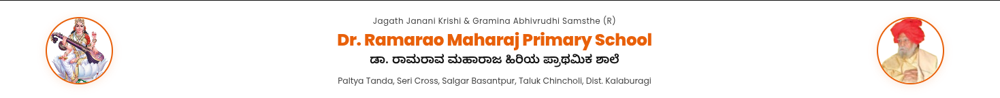
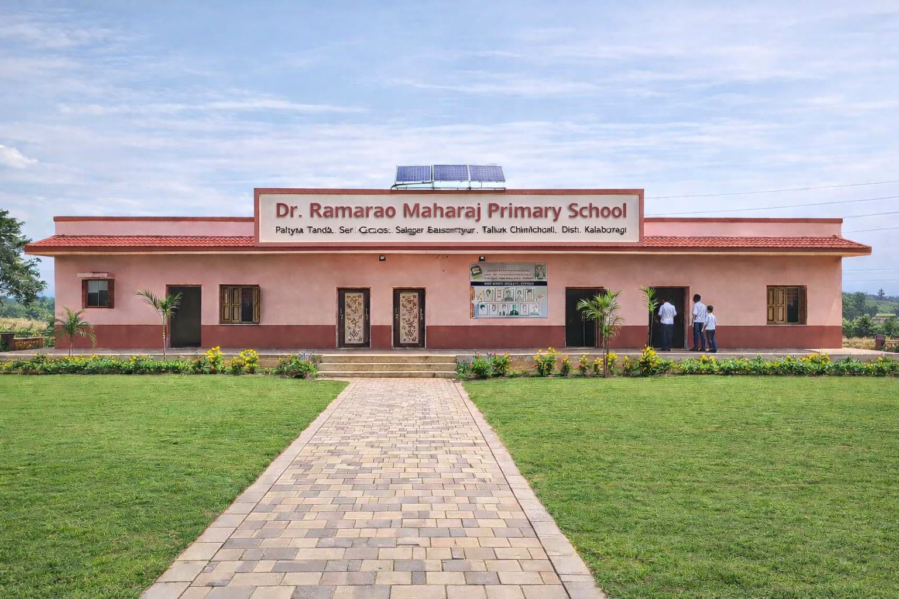
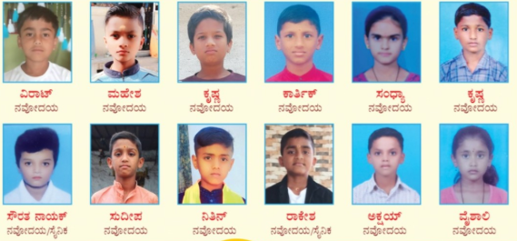
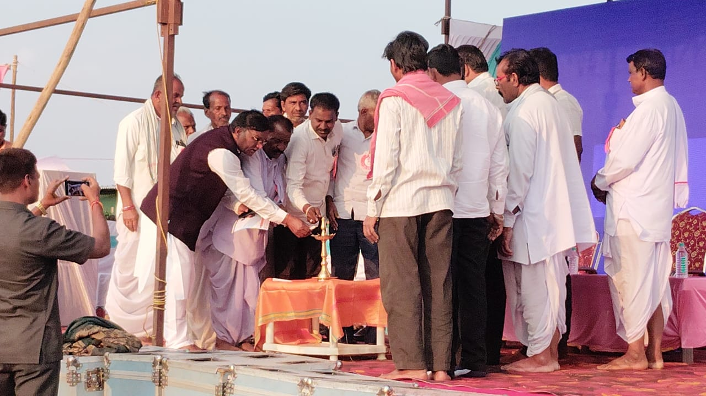
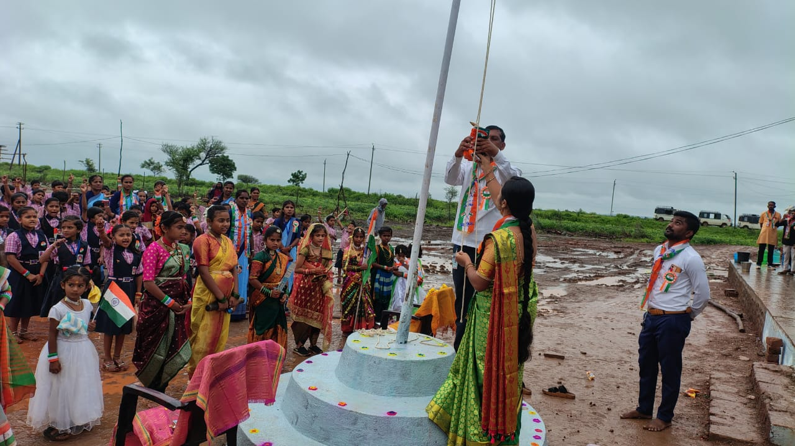

  
  
  <h1>Dr. Ramarao Maharaj Primary School</h1>
  
<strong>Paltya Tanda, Seri Cross, Salgar Basantpur, Taluk Chincholi, Dist. Kalaburagi, Karnataka</strong>

---

  

## About the School

Founded under the Jagath Janani Krishi & Gramina Abhivrudhi Samsthe, **Dr. Ramarao Maharaj Primary School** is a dedicated educational institution providing quality Kannada-medium education to students in rural Kalaburagi.

We offer a structured and comprehensive curriculum aligned with the Karnataka State Board from LKG to 8th Standard. Along with academic excellence, the school provides a nurturing residential environment and specialized coaching to help students excel and secure admissions into prestigious institutions like Jawahar Navodaya Vidyalaya and Sainik Schools.

### Key Features
* **Quality Education:** Kannada-medium classes focused on complete conceptual understanding and deep foundational learning.
* **Specialized Coaching:** Dedicated daily training for Class 3, 4, and 5 students specifically targeting Navodaya and Sainik School entrance exams.
* **Hostel Facility:** Secure and disciplined residential accommodation complete with wholesome meals and dedicated study supervision.
* **Exceptional Results:** A proud and strong track record of successful student selections year after year.

---

## Navodaya & Sainik School Selections

We take immense pride in our students who have consistently cleared the highly competitive Navodaya Vidyalaya and Sainik School entrance exams. Their remarkable success is a true testament to their unwavering hard work and our faculty's dedicated coaching.

  
  
<em>Our bright stars selected for Navodaya & Sainik Schools</em>

---

## Recent Events & Campus Life

Our school strongly believes in the holistic development of every child. We enthusiastically celebrate national holidays, cultural events, and annual sports days to build character, teamwork, confidence, and leadership skills among the students.

  
  
  
<em>Glimpses of Annual Day and Republic Day Celebrations</em>

---

## Contact Information

* **Address:** Paltya Tanda, Seri Cross, Salgar Basantpur, Chincholi, Dist. Kalaburagi, Karnataka - 585307
* **Contact Numbers:** +91-7483586279, +91-9741617557, +91-9321771082

   
  
<em>Shaping Futures, Building Character</em>

